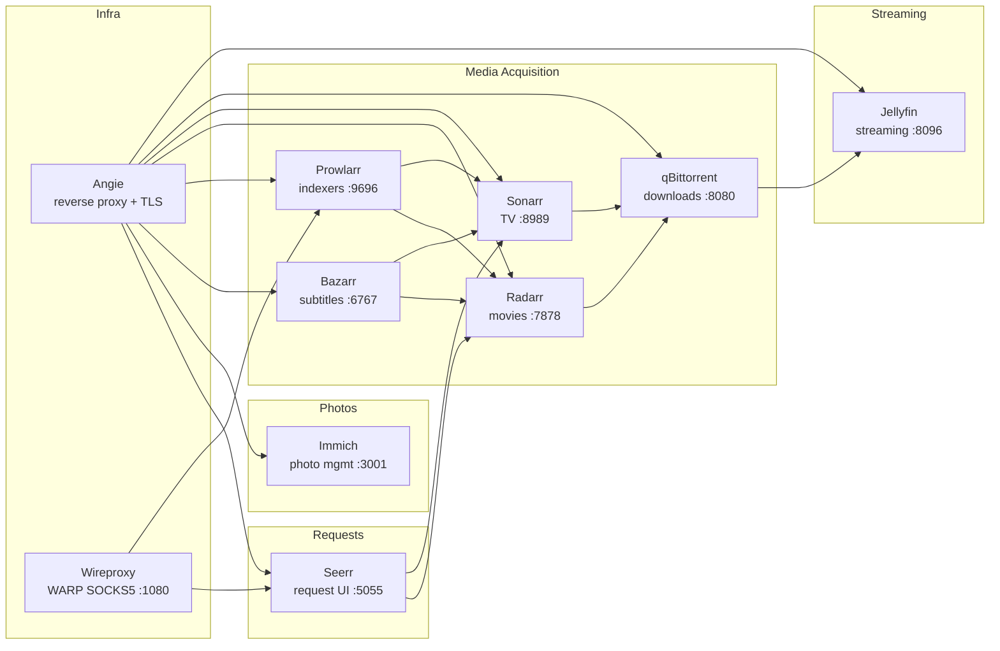
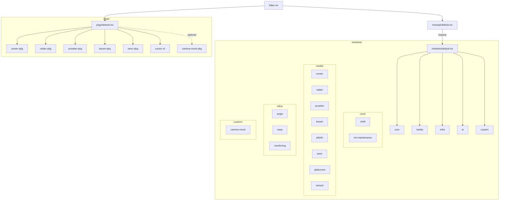

# Raspberry Pi 5 — Nix Media Stack

Single Nix flake that declares the entire Pi: **arr stack**, **Immich**, **Seerr**, and supporting infrastructure. All services are managed via home-manager; all custom packages live under `pkgs/`. Public HTTPS via DuckDNS at `rverma-pi.duckdns.org`.

## Architecture



## Public URLs

All served over HTTPS via Angie + Lego/DuckDNS DNS challenge.

| Path                          | Service      | Port  |
| ----------------------------- | ------------ | ----- |
| `/jellyfin/`                  | Jellyfin     | 8096  |
| `/qbit/`                      | qBittorrent  | 8080  |
| `/sonarr/`                    | Sonarr       | 8989  |
| `/radarr/`                    | Radarr       | 7878  |
| `/prowlarr/`                  | Prowlarr     | 9696  |
| `/bazarr/`                    | Bazarr       | 6767  |
| `/photos/`                    | Immich       | 3001  |
| `:9443`                       | Seerr        | 5055  |

> Base domain: `https://rverma-pi.duckdns.org`

## Quick Start

```bash
git clone git@github.com:rverma-dev/mediaserver.git /home/pi/mediaserver
cd /home/pi/mediaserver
cp .env.example .env   # then fill in tokens & API keys
./init.sh
```

`init.sh` runs: `init-dirs` → `init-alloy` → `init-nix` → `init-network` → `init-security` → `init-deploy`.

---

## Services

### ARR Stack

Automated media acquisition pipeline. Prowlarr manages indexers; Sonarr/Radarr request content; qBittorrent downloads; Bazarr fetches subtitles; Jellyfin streams.

| Service       | Function                       | Config                          | Notes                                                    |
| ------------- | ------------------------------ | ------------------------------- | -------------------------------------------------------- |
| **Prowlarr**  | Indexer manager                | `config/prowlarr/config.xml`    | Runs through proxychains + WARP to bypass ISP blocking   |
| **Sonarr**    | TV automation                  | `config/sonarr/config.xml`      | Root folder: `/mnt/hdd/media/tv`; set HEVC-first quality profile |
| **Radarr**    | Movie automation               | `config/radarr/config.xml`      | Root folder: `/mnt/hdd/media/movies`; set HEVC-first quality profile |
| **Bazarr**    | Subtitle manager               | `config/bazarr/config/config.yaml` | Needs ffmpeg in PATH                                  |
| **qBittorrent** | Torrent client               | `config/qbittorrent/.../qBittorrent.conf` | LAN auth bypass: `192.168.68.0/22`            |
| **Jellyfin**  | Media server + transcoding     | `services.jellyfin`               | Prefer H.264/HEVC; AV1/VP9 too slow on Pi               |
| **Seerr**     | Request UI for movies/TV       | `config/seerr/settings.json`    | Runs through proxychains + WARP; HTTPS on `:9443`        |

### Pi 5 HEVC Priority (The Golden Child)

- For `sonarr` and `radarr`, prioritize HEVC (H.265) in quality profiles and custom formats first, then H.264.
- This helps with 4K60 playback/serve paths because Pi 5 has a dedicated HEVC decode block and usually serves these streams with near-zero CPU impact.
- If you are tuning from the UI:
  - Sonarr/Radarr → `Settings > Profiles`
    - Raise HEVC/x265 custom format score relative to AVC/H.264.
    - Keep H.264 as fallback for compatibility.

  - Keep default transcoding constraints aligned with Pi 5 capabilities (avoid forcing AV1/VP9 unless needed).

### Immich

Self-hosted photo management — upload, organize, backup, and share photos.

| Component       | Purpose                               | Storage           |
| --------------- | ------------------------------------- | ----------------- |
| `immich`        | Server                                | NVMe              |
| `immich-redis`  | Valkey cache                          | NVMe              |
| Library         | Original images                       | `/mnt/hdd/immich/library` |
| Database        | Neon PostgreSQL (see `DB_URL` in `.env`) | —             |

ML is disabled on Pi (`IMMICH_MACHINE_LEARNING_ENABLED=false`).

Access: web at `/photos/`, mobile via Immich app, or `immich` CLI.

### Infrastructure

| Component      | Function                                                        |
| -------------- | --------------------------------------------------------------- |
| **Angie**       | Reverse proxy (Nginx fork), TLS via Lego/DuckDNS               |
| **Wireproxy**  | Cloudflare WARP SOCKS5 on `127.0.0.1:1080` for Prowlarr/Seerr  |
| **Alloy**      | Grafana Cloud agent (optional, set `GCLOUD_RW_API_KEY`)         |

---

## Storage Layout

NVMe = control plane (OS, DBs, caches, metadata). HDD = data plane (media, torrents, photos).

Arr hardlinks require downloads + media on the **same filesystem**.

| Path                                      | Purpose                   |
| ----------------------------------------- | ------------------------- |
| `/mnt/hdd/downloads/{complete,incomplete}` | qBittorrent              |
| `/mnt/hdd/media/{movies,tv}`              | Sonarr / Radarr / Jellyfin |
| `/mnt/hdd/immich/library`                 | Immich originals          |

### HDD Setup

```bash
lsblk                                       # identify device
./scripts/init-hdd.sh format /dev/sda        # DESTROYS data; type YES
./scripts/init-hdd.sh fstab                  # add fstab entry
./scripts/init-hdd.sh mount                  # mount + create layout
```

**Migration**: `./scripts/migrate-arr-paths.sh`, then update root folders in Sonarr/Radarr UI and enable hardlinks. For Immich, move `data/immich` → `/mnt/hdd/immich/library`.

**Tuning**: `init-hdd.sh uas` (check UAS driver), `init-hdd.sh spindown` (disable spin-down), `make verify` (throughput check).

---

## Nix Flake Layout



Apply config: `make build` or `nix run home-manager -- switch --flake '.#pi' -b backup`

**nix-direnv**: `.envrc` loads the dev shell and `.env` on `cd`. Requires [nix-direnv](https://github.com/nix-community/nix-direnv). Run `direnv allow` once.

---

## Configuration

### .env Variables

| Variable                         | Purpose                                          |
| -------------------------------- | ------------------------------------------------ |
| `DUCKDNS_TOKEN`, `DUCKDNS_SUBDOMAIN` | Angie TLS via Lego (subdomain = `rverma-pi`) |
| `JELLARR_API_KEY`                | API key consumed by Jellarr when syncing Jellyfin |
| `SONARR_API_KEY`                 | Sonarr config template                           |
| `RADARR_API_KEY`                 | Radarr config template                           |
| `PROWLARR_API_KEY`               | Prowlarr config template                         |
| `BAZARR_API_KEY`                 | Bazarr config template                           |
| `CURSOR_API_KEY`                 | Cursor Agent CLI (auto-exported in zsh)           |
| `HDD_MOUNT_PATH`                | HDD mount point (default: `/mnt/hdd`)             |
| `GCLOUD_RW_API_KEY`             | Grafana Cloud Alloy (optional)                    |

> Fresh install: leave API keys empty, let services generate them on first run, copy from each UI (Settings → General) into `.env`, then `make build` to re-seed configs.

### Shell Aliases

| Alias                    | Command                              |
| ------------------------ | ------------------------------------ |
| `ms`                     | `cd ~/mediaserver`                   |
| `msl`                    | `journalctl --user -f`               |
| `mss`                    | status all services                  |
| `msr`                    | `systemctl --user restart`           |
| `mslog <unit>`           | `journalctl --user -u <unit>`        |
| `immich`                 | status immich stack                  |
| `warp-status`, `warp-ip` | WARP connectivity check             |

### Common Commands

```bash
make status          # all service statuses
make logs            # follow all logs
make build           # home-manager switch
make activate        # git pull + home-manager switch (Pi daily cron)
make gc              # nix garbage collection
make disk            # disk usage summary
make temps           # Pi temperature
```
